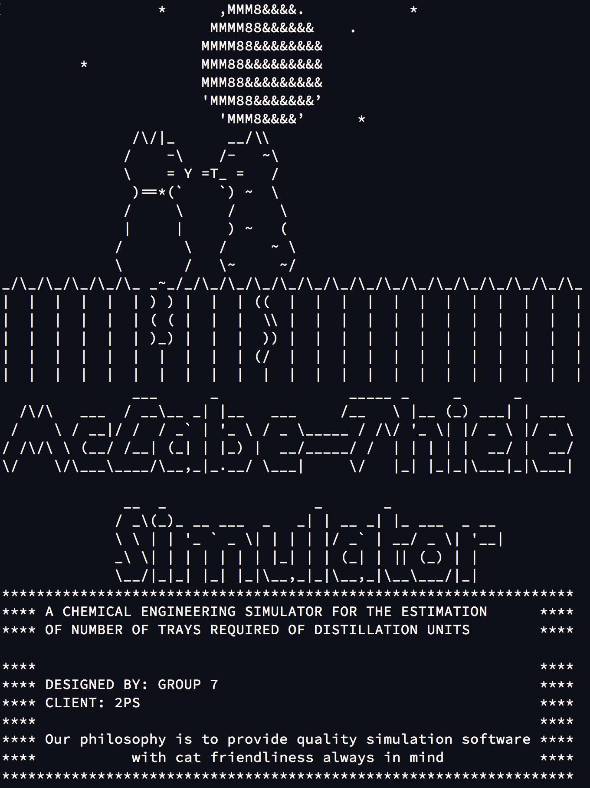

# McCabe-Thiele Simulator

This repo contains the computer-aided design project implemented in Java my teammates and I designed for our B.A.Sc. Chemical Engineering course CHG4343.  The code and report are available to review. Note that the project TA had a thing for cats and that's why we included ASCII cats in our simulator as an easter egg as instructed.

Here is a description of each file or folder:

- `McCabeThieleSimulator.zip`: Use this to open simulator in Eclipse IDE. Read `UserManual.pdf` for more information.

- `McCabeThieleSimulator.jar`: Use this to open simulator in OS shell. Read `UserManual.pdf` for more information.

- `UserManual.pdf`: Instructions on how to download, open, and run the code, either with the ECLIPSE IDE or an OS SHELL application and how to properly use your Excel file template.

- `Venture.xls`: Excel file template with venture 1 to 3 data in sheets 1 to 3, respectively. Sheets 4 to 6 are outputs generated from the code and are referred to when discussing simulator results and output. Use this template as instructed in the `UserManual.pdf`.

- `Report.pdf`: The design report submitted for the CHG 4343 course project.

- `NumericalSolution_MATLAB`: Folder containing all relevant MATLAB files that were used in the final validation process of the code. Many files are in this folder, to run the main (which executes the entry point of the code), make sure to have MATLAB’s current directory pointing inside this folder as these files all have interdependencies.

- `ActivityUML.gif`: Graphic file illustrated in report but here also if one so chooses to scale the graphics at will. Represents the exceptions catching and handling and main IO interactions between user and main method/simulator.

- `UMLDiagram.png`: Portable network graphics file illustrating the overall simulator code structure with class, interface, and package inter-dependencies. 